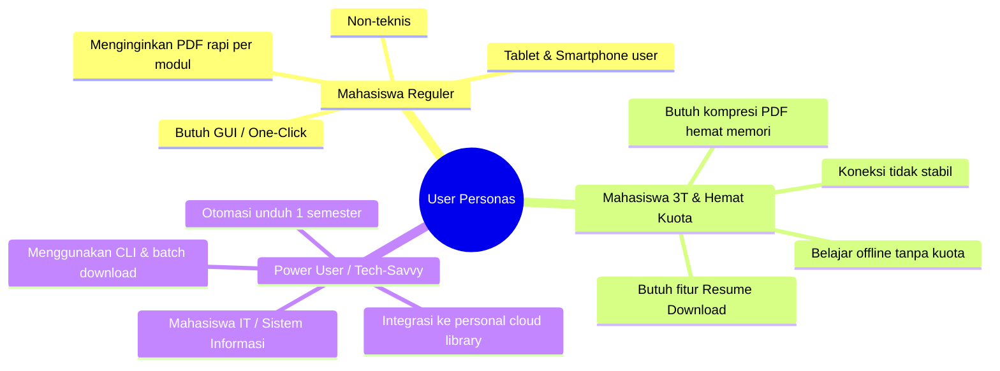
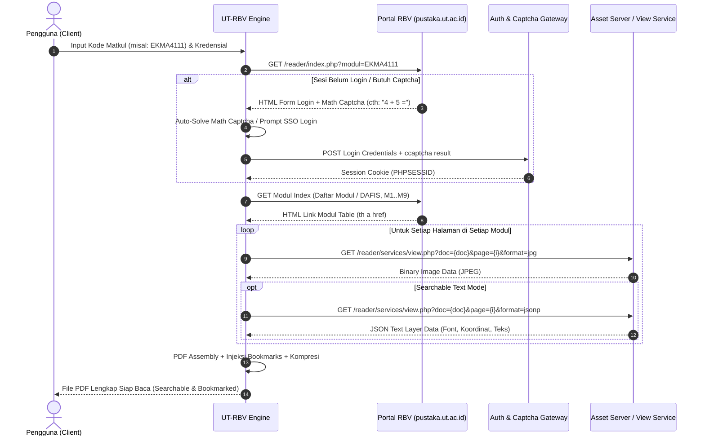
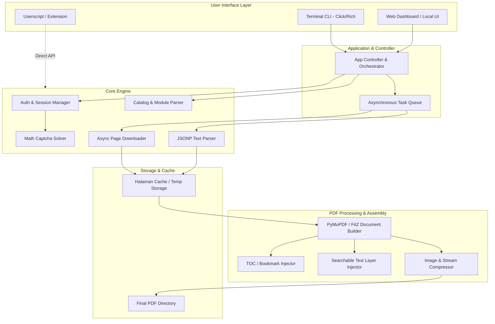
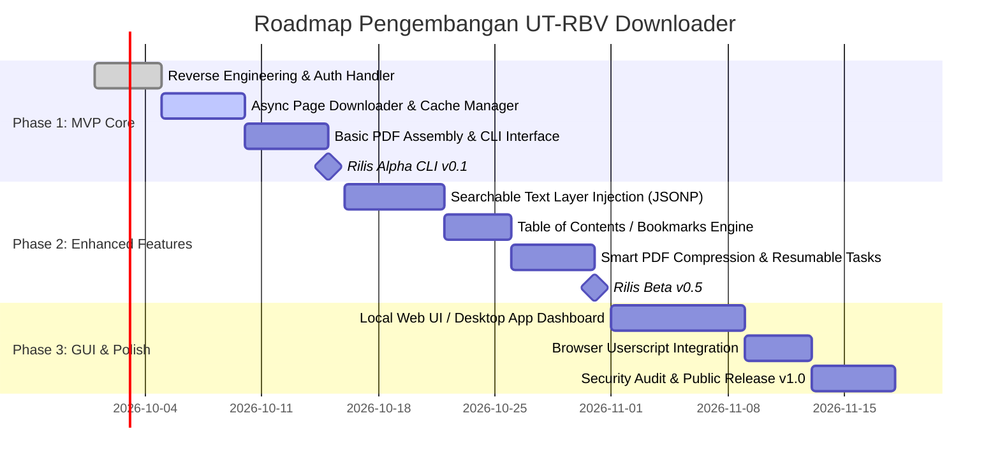

# PRODUCT REQUIREMENT DOCUMENT (PRD)
## UT-RBV Downloader: Alat Pengunduh E-Book & Modul BMP Universitas Terbuka

---

### Informasi Dokumen
| Atribut | Keterangan |
| :--- | :--- |
| **Nama Produk** | UT-RBV Downloader (BMP UT Digital Companion) |
| **Versi Dokumen** | 1.0.0 (Comprehensive Specification) |
| **Status** | Approved for Development |
| **Target Pengguna** | Mahasiswa Universitas Terbuka, Tutor, Akademisi UT |
| **Target Platform** | Python CLI / Cross-Platform GUI (Desktop & Web) / Userscript |
| **Klasifikasi Lisensi** | Open Source / Personal Fair Use Only |

---

## 1. Executive Summary & Latar Belakang

### 1.1 Latar Belakang
Universitas Terbuka (UT) merupakan perguruan tinggi negeri dengan sistem belajar jarak jauh (PJJ) terbesar di Indonesia. Seluruh mahasiswa UT dibekali bahan ajar utama berupa **Buku Materi Pokok (BMP)**. Selain buku fisik, UT menyediakan **Ruang Baca Virtual (RBV)** melalui portal `pustaka.ut.ac.id/reader/` (dan `pustaka.ut.ac.id/lib/`) agar mahasiswa dapat mengakses buku materi pokok secara daring.

### 1.2 Masalah yang Dihadapi Pengguna (Problem Statement)
1. **Ketergantungan Koneksi Internet Konstan:** RBV berbasis web viewer yang memuat halaman per halaman saat dibaca. Mahasiswa yang berada di wilayah dengan sinyal minim (3T: Terdepan, Terluar, Tertinggal) atau saat bepergian (offline) tidak dapat belajar secara efektif.
2. **Latensi & Sesi Sering Kedaluwarsa:** Viewer sering mengalami buffering lama, sesi login terputus otomatis di tengah membaca, dan kendala reload halaman.
3. **Ketidaknyamanan Membaca & Anotasi di Perangkat Tablet/E-Reader:** Mahasiswa tidak dapat menggunakan fitur stylus, highlight, penandaan dokumen, atau pembaca PDF favorit (seperti GoodNotes, Notability, Samsung Notes, Acrobat Reader, atau e-ink tablet).
4. **Beban Kuota & Efisiensi:** Membuka modul berulang-ulang melalui browser mengonsumsi kuota data berulang kali untuk konten yang identik.
5. **Keterbatasan Solusi Pihak Ketiga Saat Ini:**
   - Userscript Tampermonkey yang ada saat ini hanya mengandalkan fitur browser *Print to PDF* (`Ctrl + P`), menghasilkan ukuran file sangat besar (ratusan megabyte per buku), tanpa bookmark daftar isi, dan sering *crash* kehabisan RAM browser pada modul berhalaman tebal (300–700 halaman).
   - Skrip SDK lama belum menyediakan text layer asli, antarmuka interaktif, maupun otomatisasi kompresi dokumen.

### 1.3 Tujuan Produk (Product Objectives)
Membangun perkakas (**UT-RBV Downloader**) yang andal, cepat, aman, dan mudah digunakan untuk mengunduh modul Buku Materi Pokok (BMP) dari Ruang Baca Virtual UT menjadi file **PDF berkualitas tinggi, berukuran optimal, memiliki Table of Contents (Bookmarks) lengkap, dan mendukung pencarian teks (searchable text)** untuk kebutuhan belajar mandiri secara luring (*offline study*).

---

## 2. Target User Persona



### 2.1 Persona 1: Rian – Mahasiswa Reguler (Non-Teknis)
- **Karakteristik:** Menggunakan laptop Windows/Mac dan iPad untuk kuliah.
- **Kebutuhan:** Tampilan grafis (GUI / Web) yang sederhana. Cukup login, pilih mata kuliah dari daftar atau masukkan kode mata kuliah (misal: `EKMA4111`), klik "Download", dan mendapatkan file PDF utuh yang rapi dengan daftar isi bab.

### 2.2 Persona 2: Siti – Mahasiswa Daerah Terpencil (Koneksi Terbatas)
- **Karakteristik:** Berada di wilayah dengan jaringan seluler fluktuatif, kuota terbatas.
- **Kebutuhan:** Fitur unduh bertahap (*resumable download*). Jika koneksi putus di halaman 45 dari 80, unduhan tidak mengulang dari halaman 1. Hasil PDF harus terkompresi dengan baik tanpa mengurangi keterbacaan teks.

### 2.3 Persona 3: Dimas – Mahasiswa Sistem Informasi / Pengguna Mahir
- **Karakteristik:** Menggunakan Linux / macOS / Terminal.
- **Kebutuhan:** CLI (Command-Line Interface) dengan opsi fleksibel: unduh per modul tertentu, unduh semua modul sekaligus, custom concurrency, dan output terstruktur ke folder perpustakaan lokal.

---

## 3. Analisis Teknis & Reverse Engineering RBV UT

Berdasarkan analisis arsitektur portal `pustaka.ut.ac.id/reader/`, sistem menyajikan modul BMP melalui beberapa endpoint kunci:



### 3.1 Parameter & Endpoint Kunci
1. **Index Modul Buku:**
   - URL: `https://pustaka.ut.ac.id/reader/index.php?modul={KODE_MK}`
   - Menyajikan daftar section buku seperti:
     - `DAFIS.pdf` (Daftar Isi)
     - `M1.pdf` s/d `M9.pdf` (Modul 1 sampai Modul 9)
     - `LAMP.pdf` / `GLOSARIUM.pdf`
2. **Autentikasi & Captcha Form:**
   - Parameter Form: `username`, `password`, `_submit_check=1`, `submit=Submit`, `ccaptcha={jawaban_matematika}`.
   - Pola Pertanyaan Captcha: Text string aritmatika sederhana, misalnya: `"Berapa hasil dari 3 + 9 ="`.
   - Autentikasi Alternatif: Single Sign-On (SSO) Microsoft Office 365 (`ecampus.ut.ac.id`) atau injeksi Cookie Sesi Browser (`PHPSESSID`).
3. **Asset Viewer Service:**
   - URL Image: `services/view.php?doc={doc}&format=jpg&subfolder={kode}/&page={page}`
   - Header Wajib: `Referer: https://pustaka.ut.ac.id/reader/index.php?modul={kode}`
   - URL Text (Vector Layer): `services/view.php?doc={doc}&format=jsonp&subfolder={kode}/&page={page}`
   - Struktur JSON Text: Berisi bounding box (`height`, `width`), metadata font (`fonts`), dan teks per baris (`text`). Ini menjadi kunci utama pembuatan PDF searchable tanpa OCR!

---

## 4. Scope & Prioritas Fitur (MoSCoW Matrix)

| Kategori | Fitur | Prioritas | Deskripsi Singkat |
| :--- | :--- | :--- | :--- |
| **Core** | Login & Sesi Otomatis | **P0 (Must)** | Login akun RBV/Tuton dengan auto-solver matematika captcha. |
| **Core** | Browser Session Cookie Importer | **P0 (Must)** | Alternatif login bagi mahasiswa yang menggunakan SSO Microsoft Office 365. |
| **Core** | Fetcher Halaman Asinkron (Async) | **P0 (Must)** | Pengunduhan gambar halaman secara paralel dengan rate limit adaptif. |
| **Core** | PDF Generator Standar | **P0 (Must)** | Penggabungan halaman JPG menjadi dokumen PDF valid. |
| **Enhancement**| Table of Contents (Bookmarks) | **P1 (Should)**| Injeksi outline/bookmark otomatis (Cover, Daftar Isi, Modul 1, Modul 2, dst.). |
| **Enhancement**| Native Searchable Text Layer | **P1 (Should)**| Rekonstruksi teks langsung dari data JSONP sehingga teks bisa di-copy & di-search. |
| **Enhancement**| Resumable & Local Cache | **P1 (Should)**| Cache halaman di penyimpanan lokal; jika terputus, melanjutkan halaman tersisa. |
| **Enhancement**| PDF Compression Optimizer | **P1 (Should)**| Optimasi ukuran file (misal reduksi dari 150MB menjadi 35MB) tanpa teks buram. |
| **UI/UX** | CLI Interface Interaktif | **P0 (Must)** | Antarmuka terminal dengan progress bar (`rich` / `tqdm`). |
| **UI/UX** | Web UI / Desktop App (Local) | **P1 (Should)**| Antarmuka visual berbasis browser lokal / desktop (dashboard visual). |
| **UI/UX** | Browser Userscript (Tampermonkey)| **P2 (Could)** | Tombol langsung di browser saat membuka halaman pustaka.ut.ac.id. |
| **Advanced** | Batch Downloader 1 Semester | **P2 (Could)** | Masukkan 5-8 kode mata kuliah sekaligus, unduh otomatis dalam antrean. |
| **Advanced** | Fallback OCR (Tesseract) | **P2 (Could)** | OCR lokal jika modul versi lama tidak memiliki format `jsonp`. |
| **Out of Scope**| Public Cloud Hosting Service | **P3 (Won't)**| Tidak menyediakan server public scraping untuk menghindari pelanggaran HAKI. |

---

## 5. Rincian Kebutuhan Fungsional (Functional Requirements)

### FR-1: Autentikasi & Manajemen Sesi
- **FR-1.1 Kredensial Langsung:** Pengguna dapat memasukkan kredensial RBV / Tuton (username & password).
- **FR-1.2 Otomatisasi Captcha Matematika:** Sistem secara otomatis mengekstrak pola operasi matematika pada captcha (penjumlahan, pengurangan, perkalian, pembagian), menghitung solusinya, dan mengirimkannya dalam payload login.
- **FR-1.3 SSO & Cookie Session Passthrough:** Untuk akun yang menggunakan SSO Microsoft O365 (`ecampus.ut.ac.id`), sistem menyediakan opsi input `PHPSESSID` secara manual atau membaca cookie secara otomatis dari browser lokal (Chrome, Edge, Firefox).
- **FR-1.4 Session Heartbeat & Auto-Refresh:** Sistem mendeteksi jika sesi kedaluwarsa di tengah unduhan panjang dan melakukan re-autentikasi otomatis tanpa membatalkan proses yang sedang berjalan.

### FR-2: Penjelajahan Katalog & Ekstraksi Metadata
- **FR-2.1 Resolusi Kode Mata Kuliah:** Sistem memvalidasi kode mata kuliah (misal: `EKMA4111`, `MKDU4110`, `BIOL4101`).
- **FR-2.2 Pemetaan Struktur Buku:**
  - Mendeteksi judul buku dan nama mata kuliah.
  - Mengambil daftar dokumen (`DAFIS`, `M1` s/d `Mn`).
  - Menghitung total halaman per dokumen dengan membaca respons halaman pertama.
- **FR-2.3 Pilihan Cakupan Unduh:**
  - Unduh seluruh buku (Semua Modul 1 sampai N).
  - Unduh modul pilihan tertentu (misal: hanya Modul 3 dan Modul 4 untuk persiapan kuis).

### FR-3: Mesin Unduh Cerdas (Smart Fetching Engine)
- **FR-3.1 Unduhan Paralel (Concurrency Control):** Menggunakan asynchronous HTTP client (`aiohttp` / `httpx`) dengan batas pekerja paralel yang dapat dikonfigurasi (default: 4-6 worker) agar efisien namun tidak membebani server universitas.
- **FR-3.2 Rate Limiting & Ethical Jitter:** Jeda acak (jitter 100ms - 300ms) antar request untuk menghindari pemblokiran IP oleh firewall / WAF.
- **FR-3.3 Mekanisme Retry & Backoff Eksponensial:** Jika request gagal (HTTP 429 / 500 / 502 / 504 / Connection Timeout), sistem mengulang otomatis hingga 5 kali dengan jeda eksponensial.
- **FR-3.4 Penyimpanan Cache Lokal:** Setiap halaman yang berhasil diunduh disimpan dalam folder cache sementara (`~/.cache/ut-rbv/{KODE_MK}/{DOC}-{PAGE}.jpg`).

### FR-4: Penyusunan Dokumen PDF (PDF Assembly Engine)
- **FR-4.1 Pembuatan Dokumen PDF Berkualitas Tinggi:** Menggunakan engine PDF modern (`PyMuPDF` / `fitz` atau `pdfme` / `img2pdf`) untuk menyatukan gambar tanpa re-encoding yang merusak kualitas.
- **FR-4.2 Injeksi Table of Contents (Bookmarks Hierarkis):**
  - Membuat hierarki outline dokumen:
    - Cover / Judul Buku
    - Daftar Isi (DAFIS)
    - Modul 1: [Nama Modul]
      - Kegiatan Belajar 1 (jika terdeteksi dari parsing)
      - Kegiatan Belajar 2
    - Modul 2: [Nama Modul]
    - Lampiran / Glosarium
- **FR-4.3 Injeksi Searchable Invisible Text Layer:**
  - Membaca file `.jsonp` yang berisi metadata teks per halaman dari RBV.
  - Menempelkan teks transparan tepat di atas koordinat teks pada gambar PDF.
  - Menghasilkan PDF yang teksnya dapat di-blok, disalin (*copy-paste*), dan dicari (*search / Ctrl+F*), tanpa perlu proses OCR yang lama.
- **FR-4.4 Opsi Penggabungan:**
  - Mode A (Default): **Single Consolidated PDF** (Satu buku utuh, misal `EKMA4111 - Pengantar Bisnis.pdf`).
  - Mode B: **Split Modules** (Terpisah per modul, misal `EKMA4111_Modul_01.pdf`, `EKMA4111_Modul_02.pdf`).
- **FR-4.5 Optimasi Ukuran File (Smart Compression):**
  - Opsi kompresi gambar JPEG dengan kualitas terkontrol (misal: Q=80 atau Q=70) untuk menghemat ukuran penyimpanan hingga 60% tanpa membuat tulisan buram.

### FR-5: Antarmuka Pengguna (UI & UX)

#### 5.1 Mode Command Line Interface (CLI)
Contoh penggunaan perintah CLI yang intuitif:
```bash
# Unduh buku lengkap satu mata kuliah
ut-rbv download EKMA4111

# Unduh modul tertentu saja dengan output folder kustom
ut-rbv download MSIM4103 --modules 1,2,3 --output ./Kuliah_Semester_3/

# Unduh menggunakan session cookie SSO browser
ut-rbv download SKOM4101 --cookie "PHPSESSID=abcdef123456"

# Unduh dan langsung kompresi ukuran file
ut-rbv download BIOL4101 --compress-level medium --merge
```

Tampilan CLI menyertakan antarmuka terminal modern (Rich Library):
- Tabel informasi mata kuliah (Kode, Judul, Jumlah Modul, Estimasi Halaman).
- Progress bar interaktif untuk setiap modul dan progress total.
- Ringkasan hasil unduhan (lokasi file PDF, ukuran file, waktu proses).

#### 5.2 Mode Web Dashboard / Local GUI
- **Dashboard Minimalis & Elegan:** Antarmuka web lokal (dapat dijalankan via `ut-rbv web` atau aplikasi desktop berbasis webview/Tauri).
- **Fitur GUI:**
  - Form Login / Input Session Cookie.
  - Search bar kode mata kuliah dengan auto-suggestions.
  - Visual preview thumbnail cover buku.
  - Checklist modul yang ingin diunduh.
  - Tombol aksi: "Download Terpilih", "Download Lengkap (Merged PDF)".
  - Live progress counter dan tombol "Buka File di Explorer / PDF Viewer".

---

## 6. Kebutuhan Non-Fungsional (Non-Functional Requirements)

| Aspek | Spesifikasi Kebutuhan |
| :--- | :--- |
| **Kinerja (Performance)** | - Waktu penggabungan PDF < 15 detik untuk buku 400 halaman.<br>- Kecepatan unduh adaptif, menyelesaikan 1 modul (50 halaman) dalam < 25 detik pada koneksi 20 Mbps. |
| **Keandalan (Reliability)** | - Toleransi kegagalan koneksi: auto-resume tanpa korupsi file.<br>- Verifikasi integritas header JPEG sebelum digabung ke PDF. |
| **Keamanan & Privasi** | - Zero-Cloud: Kredensial tidak pernah dikirim ke pihak ketiga selain server resmi UT.<br>- Penyimpanan lokal kredensial terenkripsi (menggunakan keyring OS atau hanya sesi memori). |
| **Kompatibilitas Sistem** | - Mendukung Windows 10/11, macOS (Intel & Apple Silicon), Linux (Ubuntu, Debian, Arch).<br>- Mendukung eksekusi di smartphone via Android Termux (Python CLI). |
| **Kebutuhan Memori** | - Pengolahan streaming: penggunaan RAM tidak melebihi 256 MB bahkan saat memproses buku tebal 700 halaman. |

---

## 7. Desain Arsitektur Perangkat Lunak



### 7.1 Struktur Folder Proyek Rekomendasi
```text
UT-RBV/
├── docs/
│   ├── PRD_UT_RBV_DOWNLOADER.md
│   └── ARCHITECTURE.md
├── src/
│   └── ut_rbv/
│       ├── __init__.py
│       ├── cli.py             # Entrypoint Command Line Interface
│       ├── web/               # Local Web UI Dashboard
│       │   ├── app.py
│       │   ├── static/
│       │   └── templates/
│       ├── core/
│       │   ├── __init__.py
│       │   ├── auth.py        # Login, cookie management & captcha solver
│       │   ├── catalog.py     # Parser modul dan halaman RBV
│       │   ├── downloader.py  # Async image & JSONP fetcher
│       │   └── session.py     # Network session & retry handler
│       ├── pdf/
│       │   ├── __init__.py
│       │   ├── builder.py     # PDF assembly dari image sequence
│       │   ├── bookmarks.py   # Injeksi Table of Contents / Outline
│       │   ├── text_layer.py  # Injeksi invisible searchable text
│       │   └── optimizer.py   # Kompresi PDF
│       └── utils/
│           ├── config.py
│           ├── logger.py
│           └── paths.py
├── pyproject.toml
├── README.md
└── requirements.txt
```

---

## 8. Kepatuhan Hukum, Etika, & Batasan Penggunaan (Legal & Fair Use)

> [!IMPORTANT]
> **Pernyataan Doktrin Fair Use & Hak Cipta:**
> Seluruh konten Buku Materi Pokok (BMP) adalah milik dan dilindungi Hak Kekayaan Intelektual (HAKI) Universitas Terbuka. Perkakas ini dikembangkan **khusus untuk memfasilitasi mahasiswa aktif UT membaca materi ajar secara offline (*fair use*)** demi kelancaran studi akademik pribadi.

### 8.1 Aturan Kepatuhan & Keamanan:
1. **Khusus Mahasiswa Resmi:** Perkakas ini memerlukan akun resmi UT yang sah (kredensial RBV/Tuton atau SSO ecampus). Tidak ada fitur *bypass paywall* atau pembobolan akun.
2. **Larangan Komersialisasi & Distribusi:** Dilarang keras menyebarluaskan, mengunggah ulang ke situs publik (seperti Scribd, CourseHero, Google Drive publik), atau memperjualbelikan dokumen PDF hasil unduhan.
3. **Etika Server (Server Courtesy):**
   - Wajib menerapkan rate-limiting (maksimal 4-6 request per detik).
   - Menghindari flooding yang dapat mengganggu server pembelajaran mahasiswa lain.
   - Menyertakan *User-Agent* yang terstandarisasi.

---

## 9. Rencana Implementasi & Roadmap Pengembangan



### 9.1 Tahapan Milestone
- **Milestone 1 (MVP - v0.1):** CLI fungsional untuk mengunduh modul berdasarkan kode MK, auto-login form + captcha matematika, dan menghasilkan PDF standar.
- **Milestone 2 (Enhanced Quality - v0.5):** Dukungan penuh SSO ecampus, pembuatan PDF dengan *Searchable Text Layer* asli dan *Bookmarks/TOC* hierarkis, serta kompresi file.
- **Milestone 3 (Stable & User-Friendly - v1.0):** Dashboard GUI lokal untuk pengguna non-teknis, batch download 1 semester, dokumentasi instalasi lengkap untuk Windows, macOS, Linux, dan Android Termux.

---

## 10. Matriks Risiko & Rencana Mitigasi

| Risiko Potensial | Dampak | Probabilitas | Rencana Mitigasi |
| :--- | :--- | :--- | :--- |
| **Perubahan Struktur HTML / URL RBV UT** | Tinggi | Sedang | Pisahkan modul *Parser* secara modular (HTML selectors dan endpoints didefinisikan dalam modul konfigurasi independen sehingga mudah diperbarui). |
| **Penerapan Cloudflare / WAF Proteksi Ketat** | Sedang | Rendah | Sediakan opsi *Cookie Import* dari browser asli yang telah menyelesaikan challenge WAF. |
| **Koneksi Terputus di Tengah Unduhan** | Sedang | Tinggi | Sistem caching granular per file JPEG halaman; tidak akan mengunduh ulang halaman yang sudah ada di disk cache lokal. |
| **Ukuran PDF Terlalu Besar (Memory Spill)** | Tinggi | Sedang | Gunakan arsitektur *streaming assembly* (PyMuPDF) dan kompresi JPEG lossless/visually-lossless tanpa menyimpan seluruh citra raw di memori RAM. |
| **Penyalahgunaan Akun Mahasiswa** | Kritis | Rendah | Menggunakan kebijakan zero-storage untuk kredensial: password hanya berada di memori proses aktif dan segera dihapus setelah sesi HTTP terbentuk. |

---

## 11. Kriteria Keberhasilan (Definition of Done)
1. Mahasiswa dapat mengunduh 1 mata kuliah (seluruh modul 1-9) hanya dengan mengetikkan kode matkul (misal `ut-rbv download EKMA4111`).
2. File PDF yang dihasilkan:
   - Memiliki halaman yang urut dan lengkap.
   - Memiliki outline / bookmark daftar isi yang dapat diklik di PDF reader.
   - Teks pada PDF dapat dicari (*searchable*) dan disalin (*copy-paste*).
   - Ukuran file berada dalam batas wajar (< 60 MB untuk rata-rata buku 400 halaman).
3. Proses unduh dapat dijeda dan dilanjutkan (*resumable*) jika jaringan internet terputus.
4. Tersedia instruksi instalasi dan panduan pemakaian yang jelas dalam bahasa Indonesia.
