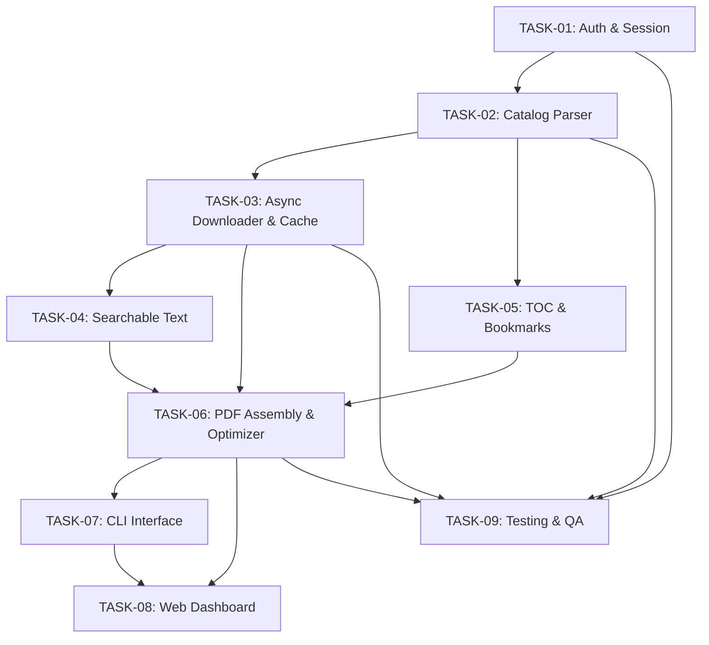

# 📋 Daftar Tugas Pengembangan (Task Board)
## Proyek: UT-RBV Downloader

Dokumen ini memetakan seluruh kebutuhan dalam [PRD_UT_RBV_DOWNLOADER.md](file:///home/itpc/UT-RBV/PRD_UT_RBV_DOWNLOADER.md) menjadi tugas-tugas teknis modular per fitur. Setiap tugas memiliki spesifikasi teknis, daftar berkas target, kriteria penerimaan (*Acceptance Criteria*), dan langkah implementasi detail.

---

### 🗺️ Matriks Tugas & Status Fitur

| ID Task | Fitur | Prioritas | Estimasi | Status | Berkas Spesifikasi |
| :--- | :--- | :--- | :--- | :--- | :--- |
| **TASK-01** | Autentikasi & Manajemen Sesi (SSO + Captcha Solver) | P0 (Must) | 3 hari | ✅ Selesai | [01-auth-session.md](file:///home/itpc/UT-RBV/tasks/01-auth-session.md) |
| **TASK-02** | Katalog & Parser Struktur Modul Buku | P0 (Must) | 2 hari | ✅ Selesai | [02-catalog-parser.md](file:///home/itpc/UT-RBV/tasks/02-catalog-parser.md) |
| **TASK-03** | Mesin Pengunduh Halaman Asinkron & Cache Lokal | P0 (Must) | 3 hari | ✅ Selesai | [03-async-downloader.md](file:///home/itpc/UT-RBV/tasks/03-async-downloader.md) |
| **TASK-04** | Injeksi Searchable Text Layer via JSONP | P1 (Should) | 3 hari | ✅ Selesai | [04-searchable-text.md](file:///home/itpc/UT-RBV/tasks/04-searchable-text.md) |
| **TASK-05** | Injeksi Daftar Isi & Bookmarks Hierarkis (TOC) | P1 (Should) | 2 hari | ✅ Selesai | [05-toc-bookmarks.md](file:///home/itpc/UT-RBV/tasks/05-toc-bookmarks.md) |
| **TASK-06** | Penyusun PDF & Pengoptimal Kompresi Gambar | P0 (Must) | 2 hari | ✅ Selesai | [06-pdf-assembly.md](file:///home/itpc/UT-RBV/tasks/06-pdf-assembly.md) |
| **TASK-07** | Antarmuka CLI Interaktif (Rich & Click) | P0 (Must) | 2 hari | ✅ Selesai | [07-cli-interface.md](file:///home/itpc/UT-RBV/tasks/07-cli-interface.md) |
| **TASK-08** | Web Dashboard Lokal / GUI Minimalis | P1 (Should) | 4 hari | ✅ Selesai | [08-web-dashboard.md](file:///home/itpc/UT-RBV/tasks/08-web-dashboard.md) |
| **TASK-09** | Pengujian Terotomasi (Unit, Mock & E2E) | P1 (Should) | 2 hari | ⚪ Pending | [09-testing-qa.md](file:///home/itpc/UT-RBV/tasks/09-testing-qa.md) |

---

### 🔄 Diagram Ketergantungan Antar Task (Dependency Graph)



---

### 📂 Struktur Direktori Kode Program

```text
UT-RBV/
├── tasks/                     # Task per feature berkas terpisah
│   ├── README.md              # Master board ini
│   ├── 01-auth-session.md
│   ├── 02-catalog-parser.md
│   ├── 03-async-downloader.md
│   ├── 04-searchable-text.md
│   ├── 05-toc-bookmarks.md
│   ├── 06-pdf-assembly.md
│   ├── 07-cli-interface.md
│   ├── 08-web-dashboard.md
│   └── 09-testing-qa.md
├── src/
│   └── ut_rbv/
│       ├── __init__.py
│       ├── cli.py             # Entry point CLI
│       ├── core/              # Komponen jaringan, auth & katalog
│       │   ├── __init__.py
│       │   ├── auth.py
│       │   ├── catalog.py
│       │   ├── downloader.py
│       │   └── session.py
│       ├── pdf/               # Komponen pembuatan & modifikasi PDF
│       │   ├── __init__.py
│       │   ├── builder.py
│       │   ├── bookmarks.py
│       │   ├── text_layer.py
│       │   └── optimizer.py
│       ├── web/               # Dashboard Web lokal
│       │   ├── __init__.py
│       │   ├── app.py
│       │   ├── static/
│       │   └── templates/
│       └── utils/             # Helper konfig, cache, logging
│           ├── __init__.py
│           ├── config.py
│           ├── logger.py
│           └── paths.py
├── tests/
│   ├── __init__.py
│   ├── test_auth.py
│   ├── test_catalog.py
│   ├── test_downloader.py
│   └── test_pdf.py
├── pyproject.toml
├── requirements.txt
├── README.md
└── PRD_UT_RBV_DOWNLOADER.md
```
